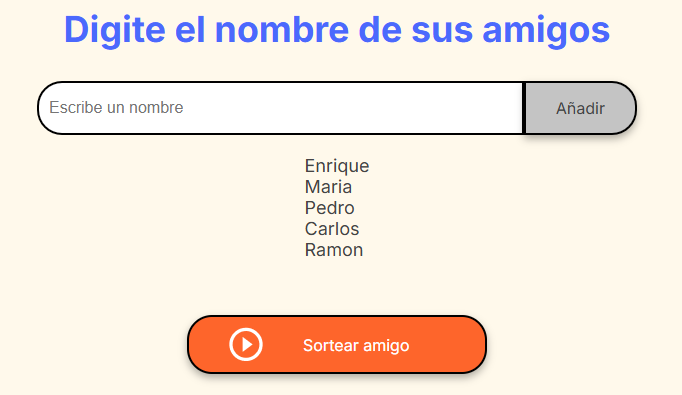

# Amigo Secreto

## Descripción
Esta es una aplicación web para jugar al amigo secreto. Los usuarios pueden agregar nombres de amigos y sortear un amigo secreto de manera aleatoria. La aplicación muestra el nombre del amigo sorteado.

## Instalación

1. Clona este repositorio en tu máquina local:
    ```bash
    git clone https://github.com/tu-usuario/amigo-secreto.git
    ```

2. Navega al directorio del proyecto:
    ```bash
    cd amigo-secreto
    ```

## Dependencias
No se requieren dependencias adicionales ya que esta aplicación está construida con HTML, CSS y JavaScript puro. 

## Cómo Ejecutarlo

1. Abre el archivo `index.html` en tu navegador preferido.
2. La aplicación estará lista para su uso.

## Funcionalidad

1. **Agregar amigos**: Escribe el nombre de un amigo en el campo de texto y haz clic en "Añadir" para agregarlo a la lista.

    

2. **Sortear amigo secreto**: Una vez que hayas agregado todos los nombres, haz clic en "Sortear amigo" para elegir aleatoriamente un nombre de la lista.

    

3. **Ver resultado**: El nombre del amigo secreto sorteado se mostrará en pantalla.

    

## Posibles Problemas y Soluciones

### Problema: La lista de amigos está vacía
**Solución**: Asegúrate de haber agregado nombres antes de intentar sortear un amigo secreto. Aparecerá una alerta si intentas sortear sin amigos en la lista.

### Problema: No se puede ver el diseño correctamente
**Solución**: Verifica que los archivos CSS y las imágenes estén en las rutas correctas (`style.css` y `assets/`). Si modificaste la estructura de carpetas, actualiza las rutas en el archivo `index.html`.

### Problema: Botones no funcionan
**Solución**: Asegúrate de que los ID de los elementos en el archivo `index.html` coincidan con los que se utilizan en `app.js`.

## Contribuciones
Las contribuciones son bienvenidas. Si tienes alguna idea o mejora, por favor abre un issue o envía un pull request.

